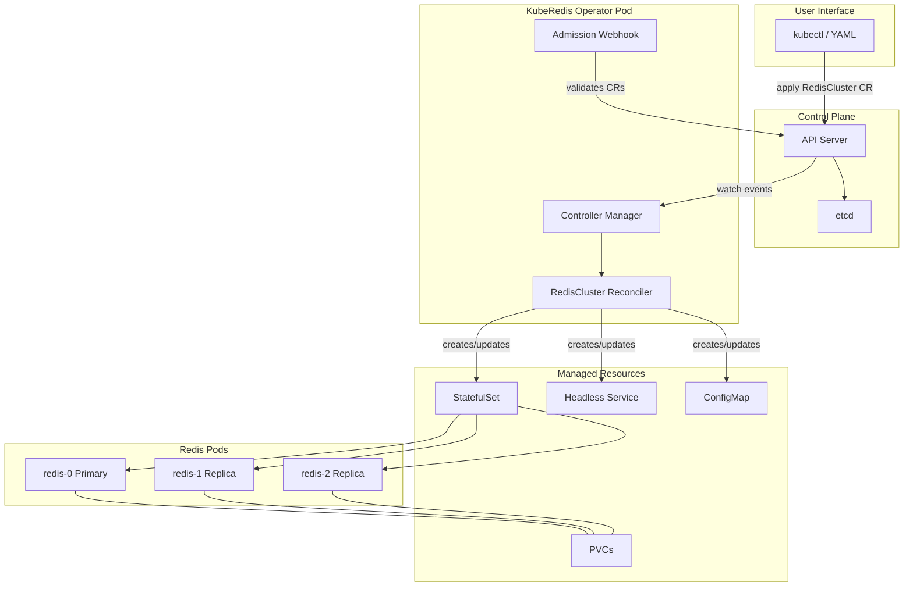

# KubeRedis Operator -- A Kubernetes Operator for Redis Cluster Lifecycle Management

---

## Why This Project Is The Best Choice

This project is about building a **Kubernetes Operator in Go** that manages a **distributed datastore's lifecycle** -- deployment, scaling, upgrades, configuration, and self-healing. You learn by doing:

- **You build an operator from scratch in Go** -- widely used for Kubernetes controllers and operators
- **You manage a stateful, distributed datastore (Redis)** -- similar patterns to other clustered databases on Kubernetes
- **You implement CRDs, reconciliation loops, status management** -- core Kubernetes extension and controller patterns
- **You handle lifecycle operations** -- scaling, rolling upgrades, backup/restore -- what production-grade operators do
- **Redis is simple enough to learn alongside Kubernetes** -- you won't get bogged down understanding the database itself

Every phase reinforces concepts you'll use in real clusters and interviews. By the end, you'll have a solid, end-to-end operator-style project to discuss.

---

## Problem Statement

Managing stateful database clusters on Kubernetes is hard. Kubernetes handles stateless apps well, but databases need ordered deployment, stable network identities, persistent storage, careful rolling upgrades, and backup/restore. **KubeRedis Operator** automates the full lifecycle of a Redis cluster on Kubernetes using the operator pattern -- a custom controller that watches a `RedisCluster` Custom Resource and reconciles the actual state to the desired state.

---

## Phased Roadmap

### Phase 1: Kubernetes Fundamentals + Go Microservice (Week 1-2) -- MVP v1

**Goal:** Get comfortable with core Kubernetes resources by deploying a Go app you wrote.

**What you build:**

- A simple Go REST API that acts as a key-value store (in-memory, backed by a map)
- Dockerfile to containerize it
- Kubernetes manifests to deploy it on `kind` (preferred over minikube -- lighter, used in CI)

**Features:**

- `GET /keys/{key}`, `PUT /keys/{key}`, `DELETE /keys/{key}`, `GET /health`
- Deployment with 3 replicas
- Service (ClusterIP) to expose internally
- ConfigMap for app configuration (port, log level)
- Secret for an API key
- Liveness and readiness probes pointing to `/health`
- Resource requests and limits
- Namespace isolation

**Kubernetes concepts covered:**

- Pods, ReplicaSets, Deployments
- Services (ClusterIP, NodePort)
- ConfigMaps, Secrets
- Probes (liveness, readiness)
- Resource requests/limits
- Namespaces
- `kubectl` fluency (logs, describe, exec, port-forward)
- Container image building

**Folder structure at this phase:**

```
kubernetes/
  cmd/
    kvstore/
      main.go              # Go entrypoint
  internal/
    handler/
      handler.go           # HTTP handlers
    store/
      store.go             # In-memory KV store
  Dockerfile
  go.mod
  go.sum
  deploy/
    base/
      namespace.yaml
      deployment.yaml
      service.yaml
      configmap.yaml
      secret.yaml
  Makefile                 # build, docker-build, deploy, teardown
  README.md
```

---

### Phase 2: Stateful Workloads -- Deploy Redis Properly (Week 3-4) -- MVP v2

**Goal:** Understand why StatefulSets exist and how persistent storage works.

**What you build:**

- Replace the in-memory store with a real Redis deployment
- Deploy Redis as a StatefulSet (single primary + replicas)
- Your Go API now connects to Redis as its backend
- Persistent volumes so data survives pod restarts

**Features:**

- Redis StatefulSet with 3 pods (1 primary, 2 replicas)
- Headless Service for stable DNS (`redis-0.redis-headless.ns.svc.cluster.local`)
- PersistentVolumeClaims for each Redis pod
- ConfigMap for `redis.conf`
- Init container to configure primary/replica roles
- Your Go API updated to use `go-redis` client with failover

**Kubernetes concepts covered:**

- **StatefulSets** -- ordered deployment, stable identities, stable storage
- **Headless Services** -- direct pod DNS
- **PersistentVolumes, PersistentVolumeClaims, StorageClasses**
- **Init containers**
- **Pod anti-affinity** (spread Redis across nodes)
- Volume mounts, volume claim templates

**Key learning moments:**

- Delete a Redis pod and watch Kubernetes recreate it with the SAME PVC (data intact)
- Scale the StatefulSet and observe ordered scaling
- Compare Deployment vs StatefulSet behavior

---

### Phase 3: Helm Chart + Configuration Management (Week 5) -- Intermediate v1

**Goal:** Package your Redis deployment as a reusable, parameterized Helm chart.

**What you build:**

- Helm chart for the entire stack (Go API + Redis cluster)
- Values file for different environments (dev, staging)
- NOTES.txt with post-install instructions

**Features:**

- Parameterized replica count, resource limits, storage size
- Conditional features (metrics exporter, persistence on/off)
- Helm hooks for pre-install validation

**Kubernetes concepts covered:**

- Helm charts, templates, values
- Release management (install, upgrade, rollback)
- Template functions, conditionals, loops

**Folder structure addition:**

```
  charts/
    kuberedis/
      Chart.yaml
      values.yaml
      values-dev.yaml
      templates/
        deployment.yaml      # Go API
        statefulset.yaml     # Redis
        service.yaml
        configmap.yaml
        _helpers.tpl
        NOTES.txt
```

---

### Phase 4: Custom Controller in Go (Week 6-7) -- Intermediate v2

**Goal:** Understand the controller pattern by building one from scratch using `client-go` before using a framework.

**What you build:**

- A Go controller that watches `ConfigMap` resources with a specific label
- When the ConfigMap changes, the controller updates the Redis configuration and triggers a rolling restart
- Deployed as a Deployment in the cluster with proper RBAC

**Features:**

- SharedInformer watching ConfigMaps labeled `app=kuberedis`
- Work queue for rate-limited event processing
- Reconciliation logic: compare ConfigMap data with current Redis config
- RBAC: ServiceAccount, Role, RoleBinding with least-privilege
- Leader election (so only one controller instance acts)

**Kubernetes concepts covered:**

- **client-go library** -- the foundation of all Kubernetes controllers
- **Informers and caches** -- how controllers efficiently watch resources
- **Work queues** -- rate limiting, retries, exponential backoff
- **Reconciliation loop** -- the core pattern of every operator
- **RBAC** -- ServiceAccount, Role, ClusterRole, RoleBinding
- **Leader election** -- critical for HA controllers

**This is the most important phase.** Building a raw controller with `client-go` teaches you what frameworks like kubebuilder abstract away. For Kubernetes-focused roles, being able to explain this layer shows depth beyond YAML and Helm.

---

### Phase 5: Full Operator with CRDs using Kubebuilder (Week 8-10) -- Advanced v1

**Goal:** Build a real operator with a Custom Resource Definition.

**What you build:**

- A `RedisCluster` CRD with spec and status fields
- An operator (using kubebuilder) that reconciles `RedisCluster` resources
- Full lifecycle management: create, scale, update config, delete

**CRD example:**

```yaml
apiVersion: kuberedis.example.com/v1alpha1
kind: RedisCluster
metadata:
  name: my-redis
spec:
  replicas: 3
  version: "7.2"
  storage:
    size: 1Gi
    storageClassName: standard
  config:
    maxmemory: "256mb"
    maxmemory-policy: "allkeys-lru"
  resources:
    requests:
      cpu: 100m
      memory: 256Mi
status:
  phase: Running
  readyReplicas: 3
  currentVersion: "7.2"
  conditions:
    - type: Available
      status: "True"
```

**Features:**

- `RedisCluster` CRD with validation (OpenAPI schema)
- Reconciler that creates/updates: StatefulSet, Headless Service, ConfigMap, PVC
- Status subresource updates (phase, ready replicas, conditions)
- Owner references (garbage collection when CR is deleted)
- Finalizers for cleanup logic (e.g., backup before delete)
- Scaling: change `spec.replicas`, operator adjusts StatefulSet
- Config updates: change `spec.config`, operator updates ConfigMap and triggers rolling restart
- Version upgrades: change `spec.version`, operator performs rolling update of container image

**Kubernetes concepts covered:**

- **Custom Resource Definitions (CRDs)** -- extending the Kubernetes API
- **Kubebuilder / controller-runtime** -- the standard framework
- **Reconciliation pattern** -- desired state vs actual state
- **Status subresource** -- reporting observed state
- **Owner references** -- garbage collection
- **Finalizers** -- pre-delete hooks
- **Conditions** -- standard status reporting pattern
- **RBAC generation** via kubebuilder markers

**Folder structure addition:**

```
  operator/
    api/
      v1alpha1/
        rediscluster_types.go    # CRD Go types
        zz_generated.deepcopy.go
    controllers/
      rediscluster_controller.go # Reconciler
    config/
      crd/                       # Generated CRD YAML
      rbac/                      # Generated RBAC
      manager/                   # Controller manager deployment
    main.go
    Dockerfile
    Makefile
```

---

### Phase 6: Advanced Operator Features (Week 11-12) -- Advanced v2

**Goal:** Production-grade operator features you see in real-world database and platform operators.

**Features:**

- **Rolling upgrades** with canary validation (upgrade one pod, check health, proceed)
- **Backup/restore** using CronJobs (trigger Redis BGSAVE, copy RDB to a PVC)
- **Metrics** exposed via Prometheus (custom metrics about cluster state)
- **Events** emitted on every lifecycle action (visible via `kubectl describe`)
- **Webhook validation** (reject invalid CRs before they're persisted)
- **Multi-version CRD** (v1alpha1 -> v1beta1 with conversion webhook)

**Kubernetes concepts covered:**

- Admission webhooks (validating, mutating)
- CRD versioning and conversion
- Prometheus ServiceMonitor integration
- Kubernetes Events
- CronJobs
- Advanced reconciliation (multi-step with requeue)

---

## Architecture Overview




---

## Final Folder Structure

```
kuberedis-operator/
  cmd/
    kvstore/main.go                  # Phase 1: simple Go API
  internal/
    handler/handler.go
    store/store.go                   # Phase 1: in-memory, Phase 2: Redis-backed
  operator/
    api/v1alpha1/
      rediscluster_types.go          # Phase 5: CRD types
      rediscluster_webhook.go        # Phase 6: admission webhook
    controllers/
      rediscluster_controller.go     # Phase 5: reconciler
      rediscluster_controller_test.go
    internal/
      redis/
        health.go                    # Redis health check utilities
        config.go                    # Redis config management
  deploy/
    base/                            # Phase 1-2: raw manifests
    charts/kuberedis/                # Phase 3: Helm chart
  config/
    crd/                             # Phase 5: generated CRD manifests
    rbac/
    manager/
    webhook/                         # Phase 6
  hack/
    setup-kind.sh                    # Kind cluster setup script
  test/
    e2e/                             # End-to-end tests
  Dockerfile
  Makefile
  go.mod
  README.md
```

---

## Interview Talking Points

Map each phase to likely interview questions:


| Phase | Likely Question                          | Your Answer Starts With                                                                                                                                                                       |
| ----- | ---------------------------------------- | --------------------------------------------------------------------------------------------------------------------------------------------------------------------------------------------- |
| 1     | "Explain Pods vs Deployments"            | "When I built my kvstore API, I started with a bare Pod and then..."                                                                                                                          |
| 2     | "Why StatefulSets for databases?"        | "I deployed Redis as a StatefulSet because databases need stable identity and storage. When I deleted redis-1, Kubernetes recreated it and reattached the same PVC..."                        |
| 4     | "How does a controller work internally?" | "I built one from scratch with client-go. The informer watches the API server, pushes events to a work queue, and the worker pops items and calls my reconcile function..."                   |
| 5     | "What is the reconciliation pattern?"    | "In my operator, the reconciler compares the RedisCluster spec against what actually exists in the cluster. If the StatefulSet has 2 replicas but spec says 3, it patches the StatefulSet..." |
| 5     | "Explain CRDs and why they matter"       | "I defined a RedisCluster CRD that extends the Kubernetes API. Users apply a RedisCluster YAML just like a Deployment, and my operator handles everything..."                                 |
| 6     | "How do you handle rolling upgrades?"    | "My operator upgrades one pod at a time, runs a health check against the Redis instance, and only proceeds if healthy. If unhealthy, it rolls back..."                                        |


---

## Resume Bullets

- Built a **Kubernetes Operator in Go** using kubebuilder that manages the full lifecycle of Redis clusters -- deployment, scaling, rolling upgrades, configuration management, and backup/restore
- Designed and implemented a **Custom Resource Definition (RedisCluster)** with validation webhooks, status subresource reporting, and finalizer-based cleanup
- Implemented **reconciliation loops** using client-go informers and work queues, handling state drift detection and convergence for StatefulSets, Services, and ConfigMaps
- Developed **rolling upgrade logic** with canary validation -- upgrading one pod at a time with automated health checks and rollback on failure
- Configured **RBAC policies** with least-privilege ServiceAccounts and wrote **end-to-end tests** verifying operator behavior in ephemeral Kind clusters

---

## Weekly Build Plan

- **Week 1:** Set up Kind cluster. Write the Go kvstore API. Dockerize. Deploy with raw YAML. Learn kubectl.
- **Week 2:** Add ConfigMaps, Secrets, probes, resource limits. Practice debugging (logs, describe, exec). Break things intentionally.
- **Week 3:** Deploy Redis as StatefulSet. Set up PVCs. Headless Service. Init containers. Connect Go API to Redis.
- **Week 4:** Test failure scenarios -- kill pods, delete PVCs, scale up/down. Understand StatefulSet guarantees deeply.
- **Week 5:** Build Helm chart. Parameterize everything. Practice install/upgrade/rollback.
- **Week 6:** Build a raw controller with client-go. Watch ConfigMaps. Implement a work queue. Deploy with RBAC.
- **Week 7:** Add leader election. Write unit tests. Understand informer caching deeply.
- **Week 8:** Scaffold operator with kubebuilder. Define RedisCluster CRD types. Implement basic reconciler (create StatefulSet + Service).
- **Week 9:** Add scaling, config update, and version upgrade logic. Implement status updates and owner references.
- **Week 10:** Add finalizers. Write integration tests. Handle edge cases (partial failures, requeues).
- **Week 11:** Add admission webhooks. Implement backup CronJob logic. Add Prometheus metrics.
- **Week 12:** CRD versioning. End-to-end tests. Polish README. Record demo. Prepare interview narratives.

---

## README / Documentation Guidance

Your README should contain:

1. **Problem statement** -- why managing databases on Kubernetes is hard
2. **Architecture diagram** (mermaid in markdown)
3. **Quick start** -- 5 commands to see it working on Kind
4. **CRD reference** -- every field in the spec explained
5. **Operator behavior** -- what happens on create, scale, upgrade, delete
6. **Development guide** -- how to build, test, run locally
7. **Design decisions** -- why you chose certain patterns (this impresses interviewers)

Each phase should also have a short doc in `docs/` explaining what you learned and design trade-offs.

---

## How It Evolves Toward a Controller/Operator

This is not a bolt-on. The entire project arc IS the journey to building an operator:

- **Phase 1-2:** You are the operator (manually managing resources with kubectl)
- **Phase 3:** Helm semi-automates deployment but cannot react to runtime changes
- **Phase 4:** You build a controller that reacts to changes (the "aha" moment)
- **Phase 5:** You build a full operator with CRDs (the Kubernetes-native way)
- **Phase 6:** You add production-grade features that real operators need

By Phase 5, you will have built a credible, smaller-scale operator that exercises the same core ideas as many production Kubernetes operators. You will be able to explain controllers, reconciliation, CRDs, and stateful workloads from experience.
